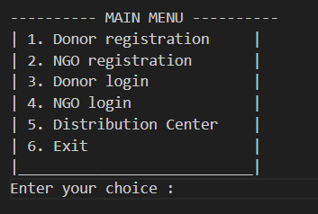
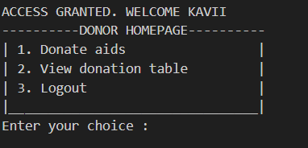
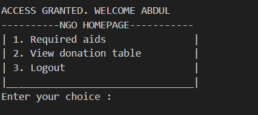
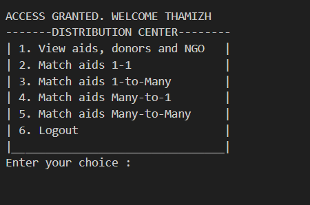

# Donation Management System

## Overview

The **Donation Management System** is designed to facilitate the efficient distribution of aid between donors, NGOs, and distribution centers. This system allows donors to contribute various forms of aid, enables NGOs to request specific items, and provides distribution centers with the ability to match donations with requests. The system is built using Java, with data managed in CSV files.

## Objectives

The main objectives of the Donation Management System are to:

- Enable donors to donate aids and view the donation table.
- Allow NGOs to request specific aids (e.g., rice, clothing) and view the donation table.
- Provide distribution centers/admins with the ability to view donors, NGOs, and aids, and match donations to requests.
- Ensure a smooth workflow for managing donations and requests.

## Scope

This project encompasses the following functionalities:

- Donor management and aid donation.
- NGO aid requests.
- Distribution center/admin oversight and matching of donations.
- Data management using CSV files.

### Platform

- **Programming Language:** Java
- **Data Management:** CSV files for storing donor, NGO, and aid data

## Functional Requirements

### Donor Functionality

- **D1. Donate Aid:** Donors can donate various types of aids.
- **D2. View Donation Table:** Donors can view a table displaying all donations made.

### NGO Functionality

- **N1. Request Aid:** NGOs can submit requests for specific aids (e.g., rice, medical supplies).
- **N2. View Donation Table:** NGOs can view a table displaying all available donations.

### Distribution Center/Admin Functionality

- **A1. View Donors:** The admin can view a list of all registered donors.
- **A2. View NGOs:** The admin can view a list of all registered NGOs.
- **A3. View Aids:** The admin can view all available aids.
- **A4. Match Aids:** The admin can match aids from donors to the requests made by NGOs.

## Implementation

The Donation Management System has been implemented using Java, and data is organized and stored in CSV files for easy access and management.
Run the program through TestMenu.java program

## Design

### Main Menu

### Donor HomePage and their functionalities

### NGO HomePage and their functionalities

### Distribution Center HomePage and their activities

